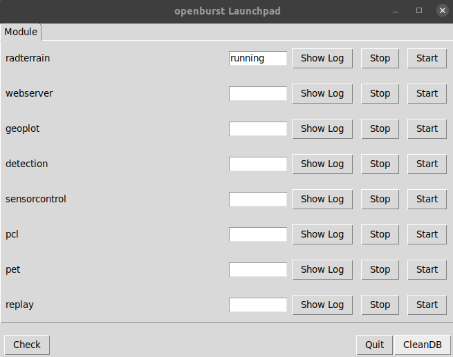
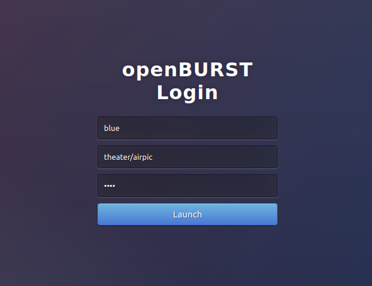
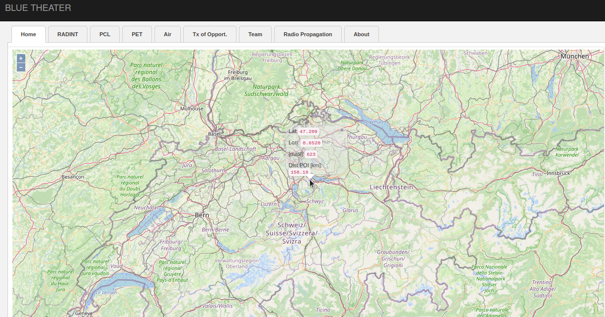
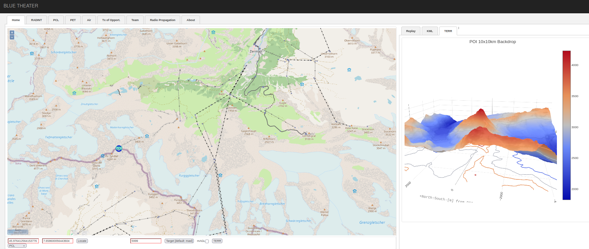
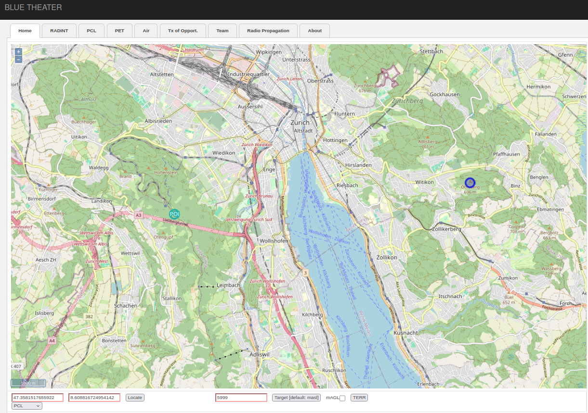
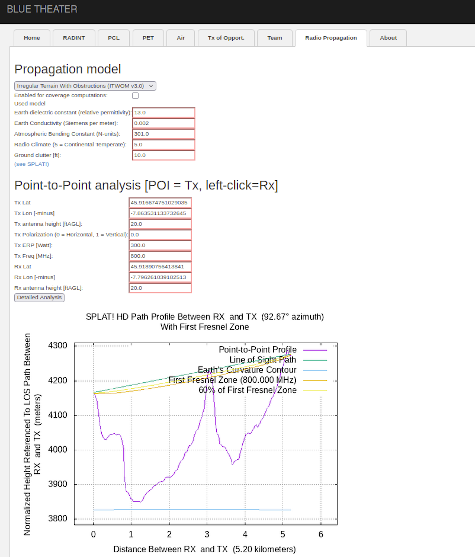
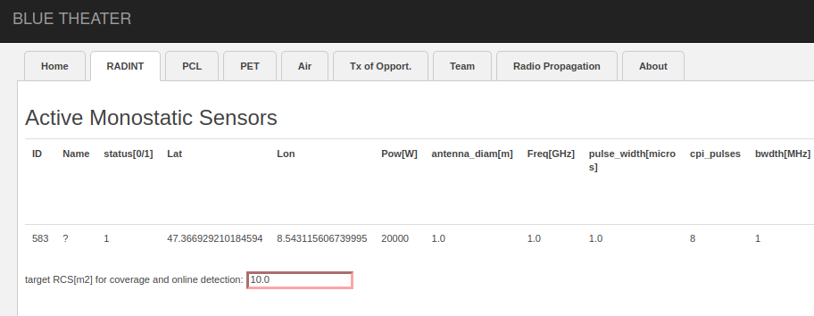
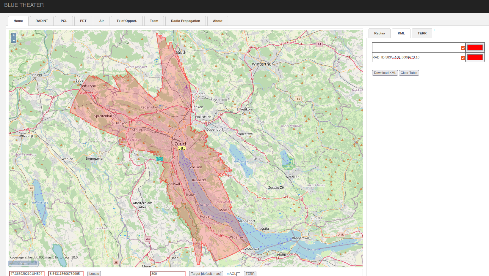

 

## Running openBURST

This assumes that openBURST was installed correctly as documented. 

### Starting the server modules

* run modules_manager.py from folder openburst/ and start the necessary modules by pressing "Start" or "Stop". Show the log files for the server using "Show Log". Each log window can be closed by simply pressing "q" after clicking on the log window. The current run status of all server modules can be checked by pressing "Check", when all currently running servers will be indicated as "running". Stop all server modules before quitting by pressing "Quit".  

### Starting the web browser client

Open a browser and type in the url: http://localhost:8888
You should get the following login page. Log in using the role "theater" by removing "/airpic" from the value in the second filed (the other role "airpic" is for viewing an airpicture). Then press the "Launch" button. 

### Elevation information

after logging in you should see a webpage with an openstreetmap (internet access is necessary). Double left click on the map to place the POI(Point of Intrerest)  icon on the map. Left click with the mouse on the map and you should be able see a pop up window with the lat, lon, masl (altitude in meters above sea level) and the distance to the previously placed POI. Note that you should have downloaded the DEM (digital elevation model) files for the area aou are interested in.

### Terrain backdrop

To get the backdrop of certain point on map, place the POI on the map and press the "TERR button at the bottom of the page. Be aware that all terrain computations needs downloading the necessary DEM files as documented. In the "TERR" tab on the right you should get the terrain backdrop for a 10x10 area with the POI in the center. See below the example for POI at the Matterhorn peak in the southern Swiss alps. 

### Point to point propagation losses

To do a sample calculation of propagation losses place the POI on the map (double left click) and the second point of interest (single left click). 

Now move to the tab "Radio propagation" and press the button "Detailed analysis". You should now get the propagation model results for a given frequency between the two above placed points on the map. 

### Radar coverage

To make a sample active radar coverage calculation, first place a radar on the map by first choosing "rad" in the drop down menu at the bottom left of the GUI. Then place an active radar on the map using "Shift-left click". A numbered circle should appear at the location of your radar. Also in the RADINT tab you should see an entry for the parameters of this radar. Change these default entries with the following values for "RCS", "Power" and "CPI_pulses" as in the image below.

Go back to the "Home" tab, click on the map and press the "c" button to initiate radar coverage calculation. You will see a blinking button at the bottom indicating the computation (note that coverage computation can be intensive depending on the set radar parameters; the computation is parallelized using Boost and MPI). Please select a color in the KML tab on the right for your coverage diagram. The coverage will be plotted on the map as soon as the computation is concluded. Please be aware that you need to have the DEM terrain files downloaded for the coverage area of the radar for this feature to work correctly.

