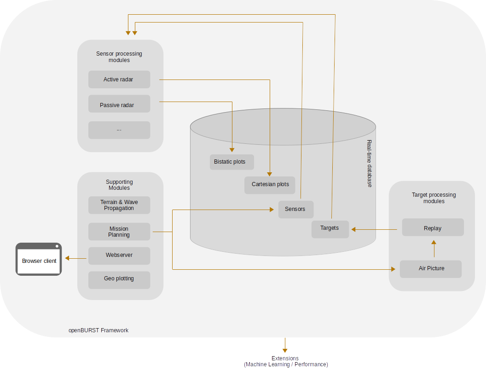

# Summary

`openBURST`[^1] is intended to provide the air surveillance sensor community with a framework for the development and testing of sensor coverage and real-time target detection analysis. `openBURST` focuses on the overall performance assessment of a sensor network. Besides static coverage diagram computations, `openBURST` facilitates real-time computation of sensor detections for simulated targets. This allows the statistical performance analysis of air picture generation in a given scenario. By providing a flexible and extendable framework to model and simulate active, passive, monostatic and multistatic sensors, `openBURST` provides the implementation of optimization and machine learning approaches for sensor portfolio performance optimization in air surveillance.

[^1]: `BURST` is an acronym for “Base Units Readiness Simulation Tool”. Burst 1969 mASL is a mountain peak in the Emmentaler Alps of canton Berne, Switzerland. The opensourced version of the original `BURST` tool was named `openBURST`.

# Statement of need

`openBURST` is a software project to design, deploy and test active/passive radar system networks for detecting simulated or recorded real world air traffic. It consists of decoupled software modules that can be replaced, extended or deployed independently for air surveillance sensor coverage and real-time detection computations. `openBURST` uses real-time communication between the distributed modules of the simulation framework, allowing for concurrent updates of target movements and sensor detections. Currently, `openBURST` supports coverage computation and real-time simulation of active radar and passive radar sensors (range-Doppler maps) using FM transmitters. The RF signal propagation, loss and terrain analysis tool [Splat!](https://www.qsl.net/kd2bd/splat.html), is extended for EM signal propagation computations with multi-core parallel processing and graphical user interfacing. `openBURST` uses [openstreetmap](https://openstreetmap.org) data with [openlayers](https://openlayers.org) for the interactive map. Terrain digital elevation data provided by [GMTED10](https://www.usgs.gov/coastal-changes-and-impacts/gmted2010) is used for Line-of-Sight and propagation loss computations. By implementing a client-server architecture, `openBURST` enables browser based clients to remain data and implementation agnostic. 

Sensor simulation for air surveillance is of considerable interest both in the civilian and military fields as it allows for performance assessments of arbitrary sensor networks in diverse scenarios of interest. Such a simulation tool should be seen as the combination of three subparts: air traffic simulation, sensor detection simulation and sensor data fusion. 

In the opensource domain, several tools exist for the subpart of air traffic simulation. E.g. BlueSky [@Bluesky:2016] presents a fully open-source and open-data approach to air traffic simulation, whereas the
OpenSky network [@Opensky:2014] is a non-profit community-based receiver network that collects air traffic surveillance data and makes it accessible to academic and institutional researchers. In the domain of air surveillance sensor detection simulation, opensource tools for passive radar simulation such as [PassiveRadarSim](https://github.com/bradleeharr/PassiveRadarSim) and for active radar simulation such as [radarsimpy](https://github.com/radarsimx/radarsimpy) have been published. In the active radar domain, sophisticated opensource tools for very specific use cases such as for Synthetic Aperture Radar (SAR), e.g. [RaySAR](https://github.com/StefanJAuer/RaySAR) or variats of generic wave propagation tools such as [gprMAX](https://github.com/gprMax/gprMax) also exist. Diverse data fusion, tracking and state estimation tools have also been opensourced such as Stonesoup [@Stonesoup2017]. However, currently no extendable real-time simulation suite for air traffic simulation and sensor detection for active/passive sensors that incorporates wave propagation modelling is available to the opensource community. `openBURST`is an attempt to fill this gap, proving the research and air surveillance simulation community with a general-purpose and modular tool, that provides a user-friendly browser based interface. 

On contrary to a number of existing open source tools for detailed simulations of single sensors (either active or passive, monostatic or bistatic etc.), `openBURST` provides an extendable framework for diverse sensor and target simulations. By parallelizing computationally intensive steps and by providing a user-friendly browser based interface, `openBURST` considerably simplifies sensor network and target simulations. For example, `openBURST` can be used to dynamically change scenarios, sensor/transmitter attributes and targets for predicting passive/active radar performance and compare with real-world test measurements as needed by recent studies [@Mala:2022]. `openBURST` provides a modular and extendable active/passive sensor network simulation framework, that can be used as the sensor model in diverse studies, such as sensor fusion performance [@Fra:2022], sensor location optimization [@Yi:2017; @Mathews:2015], learning resource optimization [@Mathews:2022] or decision making [@Mathews:2008]. In summary, `openBURST` facilitates new exciting scientific explorations of sensor network/fusion performance studies and sensor network performance benchmarking. Extensions with digital transmitters for passive radar and passive emitter tracking sensors are currently planned.

# Results Examples

# Publications and Projects

Versions of `openBURST` have been used in a number of studies for passive radar location optimization, sensor fusion, learning resource allocation in active and passive sensor networks [@Mathews:2022; @Mathews:2015; @Studer:2022; @Mousel:2017]. 

# Acknowledgements

We thankfully acknowledge the support from the the Swiss Armed Forces Staff for opensourcing `openBURST`. We also thank our colleagues at the Swiss Department of Defense, especially from the Swiss Air Force and  armasuisse Science & Technology. We acknowledge the early work for passive radar coverage computation implemented by the master thesis [@Mousel:2017].

# References